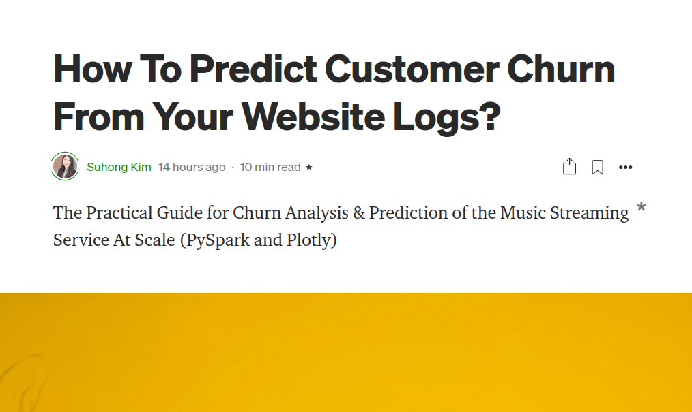
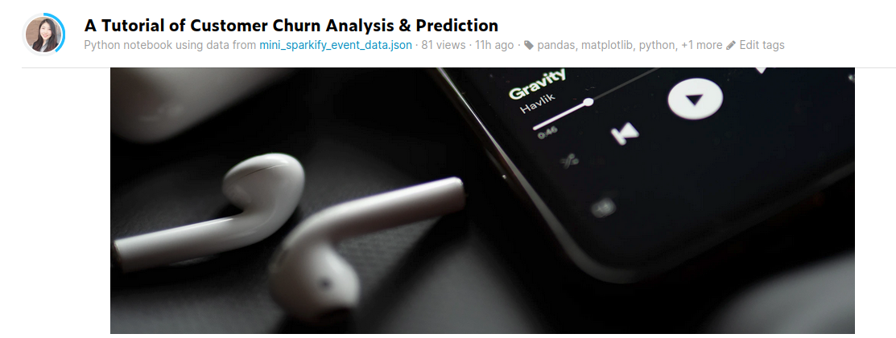

# Churn-Prediciton-At-Scale
The Customer Churn Analysis & Prediction At Scale (PySpark and Plotly)

## Table of Contents
* [Introduction](#Introduction)
* [Installation](#Installation)
* [Project Results](#Results)
* [Licensing, Authors, Acknowledgements](#License)


## Introduction<a name="Introduction"></a>
### Project Motivation 
In the music streaming industry like Sportify or YoutubeMusic, it is very important to monitor important business metrics and predict how their customers response. One of the most important metrics is "Churn" in business, which means the ratio of the users cancelling/downgrading the premium subscriptions. In this project, I build the prediction model to understand what kinds of factors affect the churn decision of users. 

### Project Description 
To process large amount of website-log data in website, which is not fit into my local computer, I need to understand how to work with the data at scale and build the prediction model with SparkMLlib. Thus, this project has three goals: 
* [x] Analyze and Visualize the website logs   
* [x] Build the ML model with SparkMLlib using mini-dataset(128MB) 
* [ ] Deploy the Spark cluster to AWS Cloud to train on the full dataset(12GB) 

## Installation<a name="Installation"></a>
### Dataset
The size of the mini-dataset is over 100MB so I uploaded the dataset with .zip format. Note that this dataset is owned by Udacity, so the full dataset (12GB) can be accessed on AWS only. Please unzip the file before use, for example, you can use the below command on Linux. 
```
unzip mini_sparkify_event_data.zip
```
### Environment Setup Using Conda Env
Below command is used on Linux 
```
conda env create -f environment.yml
source activate spark
```
### Pre-trained Models For Convenience
If you prefer to train yourself, just skip this part. Otherwise, please unzip all the models in the [models](https://github.com/suhongkim/Churn-Prediciton-At-Scale/tree/main/models) before running the notebook. Below is the example command on Linux 
```
unzip "models/*.zip"
```
### Important Files 
- [Sparkify.ipynb](https://github.com/suhongkim/Churn-Prediciton-At-Scale/blob/main/Sparkify.ipynb): the notebook contains all the code, working locally. 
- [Sparkify.html](https://github.com/suhongkim/Churn-Prediciton-At-Scale/blob/main/Sparkify.html): the snapshot of the "Sparkify.ipynb" with the results 
- [Sparkify_udacity.ipynb](https://github.com/suhongkim/Churn-Prediciton-At-Scale/blob/main/Sparkify_udacity.ipynb): the default notebook provided by Udacity 
- [models/](https://github.com/suhongkim/Churn-Prediciton-At-Scale/tree/main/models) : the directory for the saved models from the notebook 

## Results<a name="Results"></a>
- For the overview and general explanation of this project, please check my [Medium Post: "How to Predict Customer Churn From Your Website Logs?" ](https://suhongk.medium.com/how-to-predict-customer-churn-from-your-website-logs-bb02ea58385a)
<a href=https://suhongk.medium.com/how-to-predict-customer-churn-from-your-website-logs-bb02ea58385a>
  
</a>

- If you want to play with my code online, you want to visit my [Kaggle Post: 
"A Tutorial of Customer Churn Analysis & Prediction"](https://www.kaggle.com/suhong/a-tutorial-of-customer-churn-analysis-prediction) 

<a href=https://www.kaggle.com/suhong/a-tutorial-of-customer-churn-analysis-prediction>
  
</a>


## Licensing, Authors, Acknowledgements<a name="License"></a>
This project is the part of [the Udacity Data Scientist Nanodegree Program](https://www.udacity.com/course/data-scientist-nanodegree--nd025). The topic and dataset are given from the Udacity **but the code and contents are written by myself**. Plus, to create the pipline, I got some help from this [blog](https://www.timlrx.com/blog/feature-selection-using-feature-importance-score-creating-a-pyspark-estimator)

If you think that it is useful, please connect with me via [linkedIn-Suhong](https://www.linkedin.com/in/suhongkim/)


